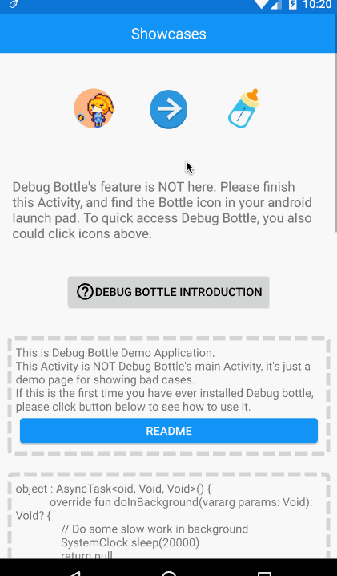
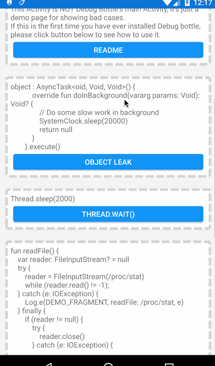

<a href="https://travis-ci.org/kiruto/debug-bottle" title="Latest push build on default branch: created">
  
</a>
<a href="https://mvnrepository.com/artifact/com.exyui.android/debug-bottle-runtime" name="status-images" title="Latest version on maven-central">
  
</a>

[🇨🇳 中文](README-ZH.md) / [🇯🇵日本語](README-JP.md) / [🇬🇧 English](README.md)

# 🍼Debug Bottle
Android Java / Kotlin 程序员开发调试工具。Debug Bottle的所有功能均建立在App的debug版本中，不会对release版本产生任何影响。Debug Bottle旨在提高开发效率，把控App质量。

- [CHANGELOG](CHANGELOG.md)
- [TODO](TODO.md)

Demo App可在Google Play中下载:

<a href="https://play.google.com/store/apps/details?id=me.chunyu.dev.yuriel.kotdebugtool"></a>

[](screenshots/raw/introduction.gif)
[](screenshots/raw/quick-toggles.png)
[](screenshots/raw/features-2.png)

## 功能

- [简易的HTTP请求嗅探](#Http监听)
- [3D化Activity视图](#3D化视图)
- [Shared Preferences编辑器](#shared-preferences编辑器)
- [使用Strict mode调试软件](#使用strict-mode)
- [截获App崩溃，收集崩溃日志](#崩溃日志)
- [轻松找到可能出现的内存泄漏代码](#使用leak-canary)
- [找到可能出现的UI卡顿代码](#使用block-canary)
- [简易创造Activity入口，及测试Runnable](#进入一切activity并注入参数)

#### Http监听
通过OkHttp的拦截器监听通过App的Http请求，并记录在Debug Bottle的日志中。记录过的日志可以通过分享按钮分享给其他开发者。

[](screenshots/raw/network-sniffer-1.png)
[](screenshots/raw/network-sniffer-2.png)

#### 3D化视图
通过设置打开“3D”功能，可以更直观地看到当前Activity的layout结构。
本功能支持单点手势旋转，双点手势缩放和位移。

[](screenshots/raw/network-sniffer-2.png)
[](screenshots/raw/scalpel-view.gif)

#### Shared Preferences编辑器
通过Debug Bottle可以简单地编辑App用到的所有Shared Preferences。

[](screenshots/raw/network-sniffer-2.png)
[](screenshots/raw/network-sniffer-2.png)

#### 使用Strict Mode
Debug Bottle可以在运行时启用或禁用Strict Mode。StrictMode最常用来捕捉应用程序的主线程，它将报告与线程及虚拟机相关的策略违例。一旦检测到策略违例（policy violation），你将获得警告，其包含了一个栈trace显示你的应用在何处发生违例。除了主线程，我们还可以在Handler，AsyncTask，AsyncQueryHandler，IntentService等API中使用StrictMode。更多使用方法介绍，参见[官方开发者文档](https://developer.android.com/reference/android/os/StrictMode.html)。

#### 崩溃日志
收集所有崩溃的信息，存储成日志文件。

[](screenshots/raw/crash.gif)

#### 使用Leak Canary
Debug Bottle中编译进了Leak Canary，所有Leak Canary的功能都可以使用了，并且可以通过Debug Bottle来控制开关。Leak Canary的使用方法请参考[官方Wiki](https://github.com/square/leakcanary/wiki/FAQ)。

#### 使用Block Canary
加入了支持Kotlin的Block Canary，可以监控UI线程卡死。

[](screenshots/raw/network-sniffer-2.png)
[](screenshots/raw/block-canary-demo.gif)

#### 进入一切Activity并注入参数
简单的Activity／Runnable入口。可以随心所欲进入任何一个Activity，使用任何参数，甚至可以向App中注入想要测试的Intent。

[](screenshots/raw/network-sniffer-2.png)
[](screenshots/raw/run-activity-with-intent.gif)

## 使用方法

安装嵌入Debug Bottle的App后，你将看到初你App外的新图标🍼。点击进入Debug面板。

## 搭建方法

#### 1. 加入Gradle依赖
首先在工程Gradle文件中添加snapshot源：
```gradle
allprojects {
    repositories {
        ...
        maven {
            url "https://oss.sonatype.org/content/repositories/snapshots"
        }
    }
}
```

然后在主模块中（Application类所在模块）加入依赖：
```gradle
dependencies {
    debugCompile 'com.exyui.android:debug-bottle-runtime:1.0.0EAP-beta'

    // 如果你的工程是Java工程,使用此依赖
    releaseCompile 'com.exyui.android:debug-bottle-noop-java:1.0.0EAP-beta'
    testCompile 'com.exyui.android:debug-bottle-noop-java:1.0.0EAP-beta'

    // 如果你的工程是Kotlin工程,使用此依赖
    releaseCompile 'com.exyui.android:debug-bottle-noop-kotlin:1.0.0EAP-beta'
    testCompile 'com.exyui.android:debug-bottle-noop-kotlin:1.0.0EAP-beta'

    compile 'com.android.support:appcompat-v7:23.2.0+'
    compile 'com.android.support:support-v4:23.2.0+'
}
```

Debug Bottle不仅支持API 23+，还可以支持API 22. 若想使用API 22，请按照下面方式加入依赖：
```gradle
dependencies {
    debugCompile 'com.exyui.android:debug-bottle-runtime:1.0.0EAP-support22-beta'

    // 如果你的工程是Java工程,使用此依赖
    releaseCompile 'com.exyui.android:debug-bottle-noop-java:1.0.0EAP-support22-beta'
    testCompile 'com.exyui.android:debug-bottle-noop-java:1.0.0EAP-support22-beta'

    // 如果你的工程是Kotlin工程,使用此依赖
    releaseCompile 'com.exyui.android:debug-bottle-noop-kotlin:1.0.0EAP-support22-beta'
    testCompile 'com.exyui.android:debug-bottle-noop-kotlin:1.0.0EAP-support22-beta'

    compile 'com.android.support:appcompat-v7:22+'
}
```

若只需支持API23，请按照下面方式加入依赖:
```gradle
dependencies {
    debugCompile 'com.exyui.android:debug-bottle-runtime:1.0.0EAP-support23-beta'

    // 如果你的工程是Java工程,使用此依赖
    releaseCompile 'com.exyui.android:debug-bottle-noop-java:1.0.0EAP-support23-beta'
    testCompile 'com.exyui.android:debug-bottle-noop-java:1.0.0EAP-support23-beta'

    // 如果你的工程是Kotlin工程,使用此依赖
    releaseCompile 'com.exyui.android:debug-bottle-noop-kotlin:1.0.0EAP-support23-beta'
    testCompile 'com.exyui.android:debug-bottle-noop-kotlin:1.0.0EAP-support23-beta'

    compile 'com.android.support:appcompat-v7:23+'
}
```

#### 2. 编辑Manifest
加入Debug Bottle的主Activity：
```xml
<activity
    android:name="com.exyui.android.debugbottle.components.DTDrawerActivity"
    android:theme="@style/Theme.AppCompat.Light"
    android:label="调试工具"/>
```
"调试工具"是Debug Bottle在Android launch pad中显示的名称, 可以随意命名。

#### 3. 在Application中插入Debug Bottle代码

首先实现Block Canary运行必要的上下文类：
```java
public class AppBlockCanaryContext extends BlockCanaryContext {...}
```

然后在Application的onCreate中插入代码：
```java
public class MyApplication extends Application{
    @Override
    public void onCreate() {
        super.onCreate();
        DTInstaller.install(this)
            .setBlockCanary(new AppBlockCanaryContext(this))
            .setOkHttpClient(httpClient)
            .setInjector("your.package.injector.ContentInjector")
            .setPackageName("your.package")
            .enable()
            .run();
    }
}
```

或者如果你的工程是Kotlin,你还可以这样写:
```kotlin
class MyApplication: Application() {
    override fun onCreate() {
        super.onCreate()
        DTInstaller.install(this)
            .setBlockCanary(AppBlockCanaryContext(this))
            .setOkHttpClient(httpClient)
            .setInjector("your.package.injector.ContentInjector")
            .setPackageName("your.package")
            .enable()
            .run()
    }
}
```

收工。

## 相关链接
* [Leak Canary](https://github.com/square/leakcanary)
* [Android Performance Monitor](https://github.com/markzhai/AndroidPerformanceMonitor)
* [Scalpel](https://github.com/JakeWharton/scalpel)

## License

```
Debug Bottle

Copyright 2016 Yuriel (http://exyui.com).

Licensed under the Apache License, Version 2.0 (the "License");
you may not use this file except in compliance with the License.
You may obtain a copy of the License at

   http://www.apache.org/licenses/LICENSE-2.0

Unless required by applicable law or agreed to in writing, software
distributed under the License is distributed on an "AS IS" BASIS,
WITHOUT WARRANTIES OR CONDITIONS OF ANY KIND, either express or implied.
See the License for the specific language governing permissions and
limitations under the License.
```

Debug Bottle 功能实现是基于以下项目的派生:
- Apache License 2.0
  - [Android Performance Monitor](https://raw.githubusercontent.com/markzhai/AndroidPerformanceMonitor/master/LICENSE)
  - [Leak Canary](https://raw.githubusercontent.com/square/leakcanary/master/LICENSE.txt)
  - [Scalpel](https://raw.githubusercontent.com/JakeWharton/scalpel/master/LICENSE.txt)
  - [Bubbles for Android](https://raw.githubusercontent.com/txusballesteros/bubbles-for-android/master/LICENSE)
  - [Takt](https://raw.githubusercontent.com/wasabeef/Takt/master/LICENSE)
