[🇨🇳 中文](README-ZH.md) / [🇯🇵日本語](README-JP.md) / [🇬🇧 English](README.md)
# 🍼Debug Bottle
An Android debug / develop tools written using Kotlin language.

[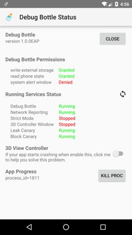](screenshots/raw/main-panel.png)
[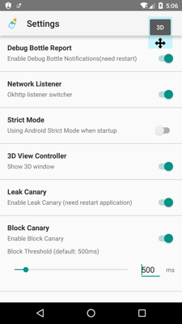](screenshots/raw/features.png)
[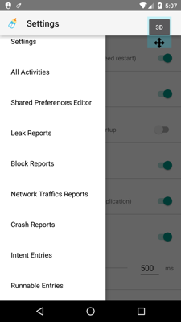](screenshots/raw/features-2.png)

## What can I do with Debug Bottle?
- [Simple OkHttp Sniffer](#okhttp-sniffer)
- [3D preview an Activity with Scalpel](#scalpel-viewer)
- [Simple shared preferences editor](#shared-preferences-editor)
- [Open strict mode any time](#strict-mode)
- [Find leaks by using Leak Canary](#leak-canary)
- [Find UI Blocks by using Block Canary](#block-canary)
- [Mock Activity or function entries in developing](#development-entries)

#### OkHttp Sniffer
Enable "Network Listener" at Settings, then you can see all network traffics what requested by your app.

[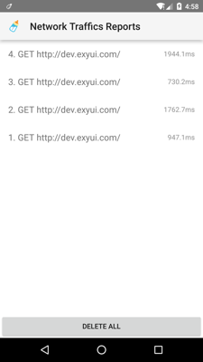](screenshots/raw/network-sniffer-1.png)
[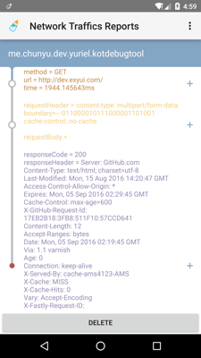](screenshots/raw/network-sniffer-2.png)

#### Scalpel Viewer
Enable "3D View", then you can view your Activity. When interaction is enabled the following gestures are supported:
* Single touch: Controls the rotation of the model.
* Two finger vertical pinch: Adjust zoom.
* Two finger horizontal pinch: Adjust layer spacing.

[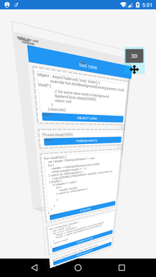](screenshots/raw/network-sniffer-2.png)

#### Shared Preferences editor
Preview and edit the Shared Preferences of app more simply.

[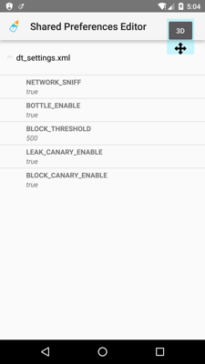](screenshots/raw/network-sniffer-2.png)
[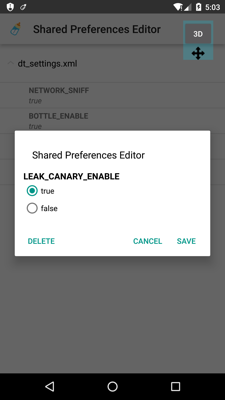](screenshots/raw/network-sniffer-2.png)

#### Strict Mode
Enable or disable Android strict mode at runtime. StrictMode is a developer tool which detects things you might be doing by accident and brings them to your attention so you can fix them. StrictMode is most commonly used to catch accidental disk or network access on the application's main thread, where UI operations are received and animations take place. For more information, see [Android Developers](https://developer.android.com/reference/android/os/StrictMode.html).

#### Leak Canary
Leak Canary is fully imported. Leak Canary is a memory leak detection library for Android and Java. More about using Block Canary by visiting [Leak Canary wiki](https://github.com/square/leakcanary/wiki/FAQ).

#### Block Canary
Detect UI blocks at runtime.

[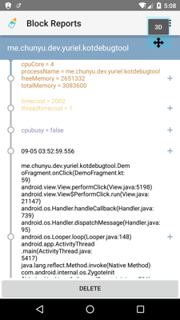](screenshots/raw/network-sniffer-2.png)
[](screenshots/raw/block-canary-demo.gif)

#### Development Entries
Launch any Activity with custom Intents, or Runnable you want.

[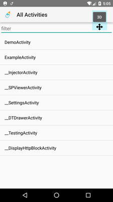](screenshots/raw/network-sniffer-2.png)
[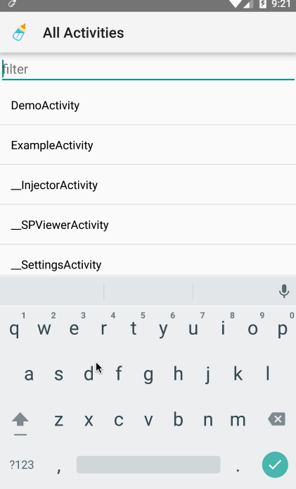](screenshots/raw/run-activity-with-intent.gif)

## How do I use it?
After installing Debug Bottle Demo app, you'll find there are two app icons appears to launcher. Click bottle icon to run Debug Bottle.

## Setting up

#### 1. Configure your Gradle project
Edit and add dependencies in your app module:

```gradle
dependencies {
    debugCompile project(':components')
    releaseCompile project(':noop')
    compile "com.android.support:appcompat-v7:23.2.0+"
    compile "com.android.support:support-v4:23.2.0+"
}
```

#### 2. Edit Manifest
Add Debug Bottle main Activity in your Manifest:
```xml
<activity
    android:name="me.chunyu.yuriel.kotdebugtool.components.__DTDrawerActivity"
    android:theme="@style/Theme.AppCompat.Light"/>
```

#### 3. Inject Debug Bottle into your Application
First, you may implement Block Canary Context:
```java
public class AppBlockCanaryContext extends BlockCanaryContext {...}
```

Now you could inject Debug Bottle in your Application like:
```java
public class MyApplication extends Application{
    @Override
    public void onCreate() {
        super.onCreate();
        Installer.install(this)
            .setBlockCanary(AppBlockCanaryContext(this))
            .setOkHttpClient(httpClient)
            .setInjector("your.package.injector.ContentInjector")
            .setPackageName("your.package")
            .run();
    }
}
```

## Links

* [Leak Canary](https://github.com/square/leakcanary)
* [Android Performance Monitor](https://github.com/markzhai/AndroidPerformanceMonitor)
* [Scalpel](https://github.com/JakeWharton/scalpel)

## License

###### Debug Bottle
```
Copyright 2016 Yuriel (http://exyui.com).

Licensed under the Apache License, Version 2.0 (the "License");
you may not use this file except in compliance with the License.
You may obtain a copy of the License at

   http://www.apache.org/licenses/LICENSE-2.0

Unless required by applicable law or agreed to in writing, software
distributed under the License is distributed on an "AS IS" BASIS,
WITHOUT WARRANTIES OR CONDITIONS OF ANY KIND, either express or implied.
See the License for the specific language governing permissions and
limitations under the License.
```

###### Android Performance Monitor
```
Copyright (C) 2016 MarkZhai (http://zhaiyifan.cn).

Licensed under the Apache License, Version 2.0 (the "License");
you may not use this file except in compliance with the License.
You may obtain a copy of the License at

   http://www.apache.org/licenses/LICENSE-2.0

Unless required by applicable law or agreed to in writing, software
distributed under the License is distributed on an "AS IS" BASIS,
WITHOUT WARRANTIES OR CONDITIONS OF ANY KIND, either express or implied.
See the License for the specific language governing permissions and
limitations under the License.
```

###### Leak Canary
```
Copyright 2015 Square, Inc.

Licensed under the Apache License, Version 2.0 (the "License");
you may not use this file except in compliance with the License.
You may obtain a copy of the License at

   http://www.apache.org/licenses/LICENSE-2.0

Unless required by applicable law or agreed to in writing, software
distributed under the License is distributed on an "AS IS" BASIS,
WITHOUT WARRANTIES OR CONDITIONS OF ANY KIND, either express or implied.
See the License for the specific language governing permissions and
limitations under the License.
```

###### Scalpel
```
Copyright 2014 Jake Wharton

Licensed under the Apache License, Version 2.0 (the "License");
you may not use this file except in compliance with the License.
You may obtain a copy of the License at

   http://www.apache.org/licenses/LICENSE-2.0

Unless required by applicable law or agreed to in writing, software
distributed under the License is distributed on an "AS IS" BASIS,
WITHOUT WARRANTIES OR CONDITIONS OF ANY KIND, either express or implied.
See the License for the specific language governing permissions and
limitations under the License.
```
